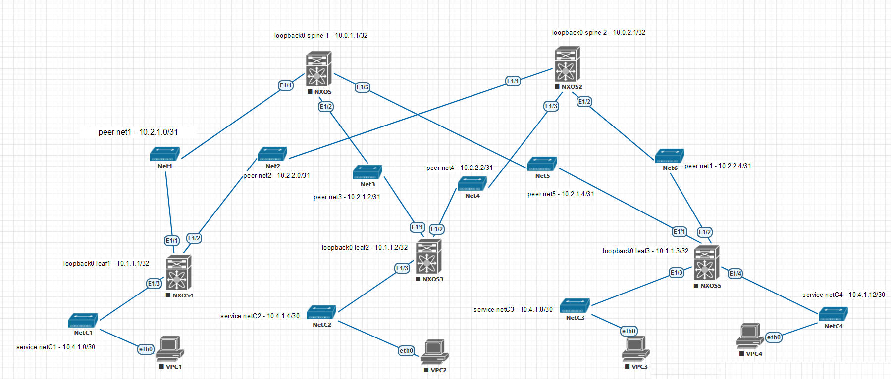

### Планирование сети

#### Задачи: 
- реализовать схему сети, указанную на рисунке,
- создать адресный план,
- назначить адреса устройств в соответствии с адресным планом.

#### Схема сети:

#### Адрессный план:

