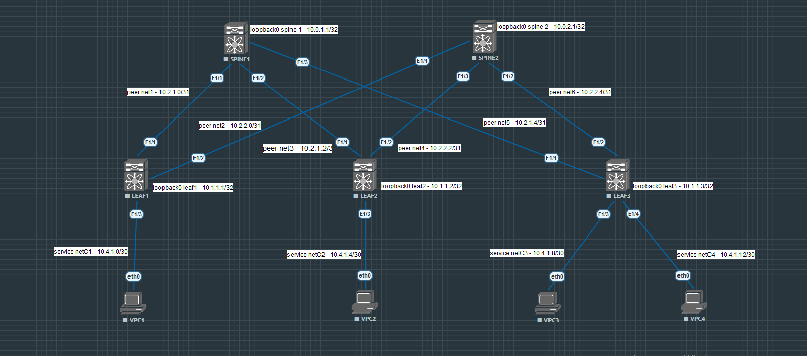

### Цель:
- настройка OSPF в Underlay сети

### План работы
- схема сети,
- адресное пространство,
- настройки

### Топология:


#### Адрессный план:
Name|spine1|spine2|leaf1|leaf2|leaf3|server1|server2|server3|server4
|---|---|---|---|---|---|---|---|---|---|
loopback|10.0.1.1|10.0.2.1|10.1.1.1|10.1.1.2|10.1.1.3|-|-|-|-
peerlinknet|10.2.1.0/31|10.2.2.0/31|10.2.1.0/31|10.2.1.2/31|10.2.1.4/31|-|-|-|-
peerlinknet|10.2.1.2/31|10.2.2.2/31|10.2.2.0/31|10.2.2.2/31|10.2.2.4/31|-|-|-|-
peerlinknet|10.2.1.4/31|10.2.2.4/31|-|-|-|-|-|-|-
clientnet1|-|-|10.4.1.0/30|10.4.1.0/30|-|-|-|-|-|-|-
clientnet2|-|-|-|10.4.1.4/30|-|-|10.4.1.4/30|-|-
clientnet3|-|-|-|-|10.4.1.8/30|-|-|10.4.1.8/30|-
clientnet4|-|-|-|-|10.4.1.12/30|-|-|-|10.4.1.12/30

### Что реализуем:
- настраиваем loopback'и на всех узлах
- настраиваем адресацию на peer-link'ах узлов и интерфейсах ПК-клиентах
- настраиваем жёстко router-id на узалах
- включаем процесс OSPF с именем Underlay
- помещаем peer-link'и узлов в процесс OSPF механизмом  'area 0.0.0.0', не используя классическое 'network ...'
- настраиваем аутентификацию узлов в OSPF по паролю

### Настройки узлов
spine1:

```
key chain OSPF
  key 0
    key-string 0 k...a
interface Ethernet1/1
  description Net1_leaf1_10.2.1.0/31
  no switchport
  no ip redirects
  ip address 10.2.1.0/31
  ip ospf authentication message-digest
  ip ospf authentication key-chain OSPF
  ip ospf network point-to-point
  ip router ospf Underlay area 0.0.0.0
  no shutdown

interface Ethernet1/2
  description Net3_leaf2_10.2.1.2/31
  no switchport
  no ip redirects
  ip address 10.2.1.2/31
  ip ospf authentication message-digest
  ip ospf authentication key-chain OSPF
  ip ospf network point-to-point
  ip router ospf Underlay area 0.0.0.0
  no shutdown

interface Ethernet1/3
  description Net5_leaf3_10.2.1.4/31
  no switchport
  no ip redirects
  ip address 10.2.1.4/31
  ip ospf authentication message-digest
  ip ospf authentication key-chain OSPF
  ip ospf network point-to-point
  ip router ospf Underlay area 0.0.0.0
  no shutdown
  
interface loopback0
  description spine1
  ip address 10.0.1.1/32
  ip router ospf Underlay area 0.0.0.0
```
spine2:

```
key chain OSPF
  key 0
    key-string 0 k...a
    
interface Ethernet1/1
  description Net2_leaf1_10.2.2.0/31
  no switchport
  no ip redirects
  ip address 10.2.2.0/31
  ip ospf authentication message-digest
  ip ospf authentication key-chain OSPF
  ip ospf network point-to-point
  ip router ospf Underlay area 0.0.0.0
  no shutdown

interface Ethernet1/2
  description Net6_leaf3_10.2.2.4/31
  no switchport
  ip address 10.2.2.4/31
  ip ospf authentication message-digest
  ip ospf authentication key-chain OSPF
  ip ospf network point-to-point
  ip router ospf Underlay area 0.0.0.0
  no shutdown

interface Ethernet1/3
  description Net3_leaf2_10.2.2.2/31
  no switchport
  ip address 10.2.2.2/31
  ip ospf authentication message-digest
  ip ospf authentication key-chain OSPF
  ip ospf network point-to-point
  ip router ospf Underlay area 0.0.0.0
  no shutdown

interface loopback0
  description spine2
  ip address 10.0.2.1/32
  ip ospf network point-to-point
  ip router ospf Underlay area 0.0.0.0
```

leaf1:
```
key chain OSPF
  key 0
    key-string 0 k...a

interface Ethernet1/1
  description Net1_10.2.1.0/31
  no switchport
  no ip redirects
  ip address 10.2.1.1/31
  ip ospf authentication message-digest
  ip ospf authentication key-chain OSPF
  ip ospf network point-to-point
  ip router ospf Underlay area 0.0.0.0
  no shutdown

interface Ethernet1/2
  description Net2_10.2.2.0/31
  no switchport
  no ip redirects
  ip address 10.2.2.1/31
  ip ospf authentication message-digest
  ip ospf authentication key-chain OSPF
  ip ospf network point-to-point
  ip router ospf Underlay area 0.0.0.0
  no shutdown

interface Ethernet1/3
  description NetC1_10.4.1.0/30
  no switchport
  ip address 10.4.1.1/30
  no shutdown
  
interface loopback0
  description leaf1
  ip address 10.1.1.1/32
  ip router ospf Underlay area 0.0.0.0
```
leaf2:
```
key chain OSPF
  key 0
    key-string 0 k...a

interface Ethernet1/1
  description Net3_10.2.1.2/31
  no switchport
  no ip redirects
  ip address 10.2.1.3/31
  ip ospf authentication message-digest
  ip ospf authentication key-chain OSPF
  ip ospf network point-to-point
  ip router ospf Underlay area 0.0.0.0
  no shutdown

interface Ethernet1/2
  description Net4_10.2.2.2/31
  no switchport
  no ip redirects
  ip address 10.2.2.3/31
  ip ospf authentication message-digest
  ip ospf authentication key-chain OSPF
  ip ospf network point-to-point
  ip router ospf Underlay area 0.0.0.0
  no shutdown

interface Ethernet1/3
  description NetC2_10.4.1.4/30
  no switchport
  ip address 10.4.1.5/30
  no shutdown

interface loopback0
  description leaf2
  ip address 10.1.1.2/32
  ip router ospf Underlay area 0.0.0.0

```

leaf3:
```
key chain OSPF
  key 0
    key-string 0 k...a

interface Ethernet1/1
  description Net5_10.2.1.4/31_spine1
  no switchport
  no ip redirects
  ip address 10.2.1.5/31
  ip ospf authentication message-digest
  ip ospf authentication key-chain OSPF
  ip ospf network point-to-point
  ip router ospf Underlay area 0.0.0.0
  no shutdown

interface Ethernet1/2
  description Net6_10.2.2.4/31_spine2
  no switchport
  no ip redirects
  ip address 10.2.2.5/31
  ip ospf authentication message-digest
  ip ospf authentication key-chain OSPF
  ip ospf network point-to-point
  ip router ospf Underlay area 0.0.0.0
  no shutdown

interface Ethernet1/3
  description NetC3_10.4.1.8_PC3
  no switchport
  ip address 10.4.1.9/30
  no shutdown

interface loopback0
  description leaf3
  ip address 10.1.1.3/32
  ip router ospf Underlay area 0.0.0.0

```

